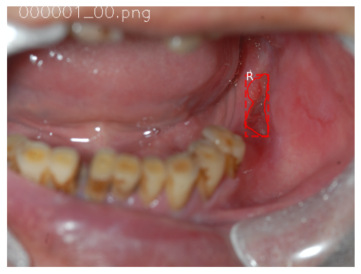
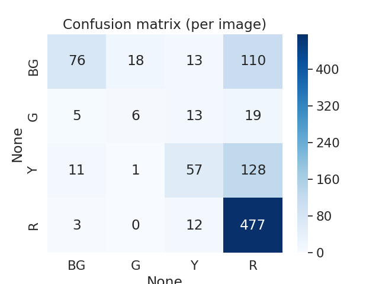
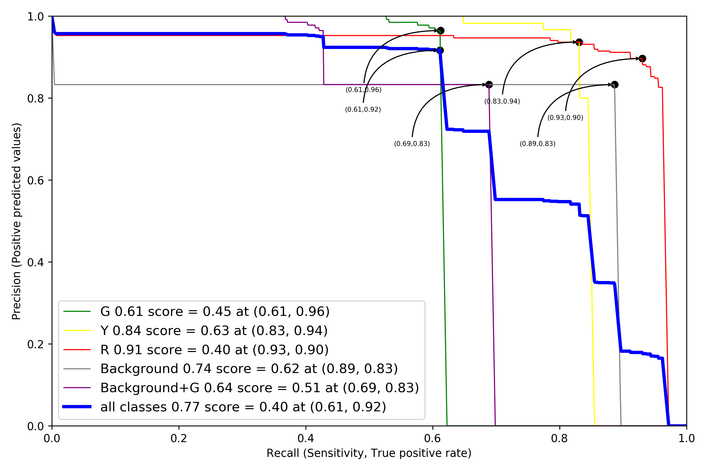
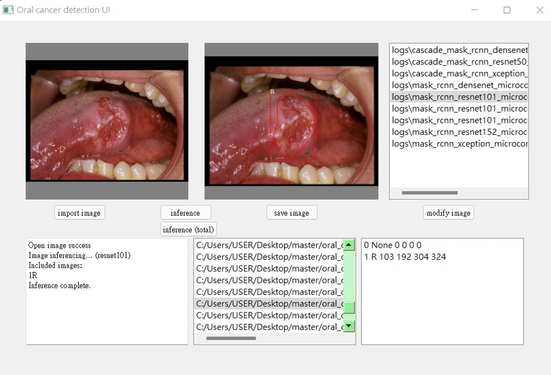

# Mask R-CNN for Object Detection and Segmentation using TensorFlow 2.0

The [Mask-RCNN-TF2](https://github.com/ahmedfgad/Mask-RCNN-TF2) project edits the original [Mask_RCNN](https://github.com/matterport/Mask_RCNN) project, which only supports TensorFlow 1.0, so that it works on TensorFlow 2.0. Based on this new project, the [Mask R-CNN](https://arxiv.org/abs/1703.06870) can be trained and tested (i.e make predictions) in TensorFlow 2.0. The Mask R-CNN model generates bounding boxes and segmentation masks for each instance of an object in the image. It's based on Feature Pyramid Network (FPN) and a ResNet101 backbone.

Compared to the source code of the old [Mask_RCNN](https://github.com/matterport/Mask_RCNN) project, the [Mask-RCNN-TF2](https://github.com/ahmedfgad/Mask-RCNN-TF2) project edits the following 2 modules:

1. `model.py`
2. `utils.py`

The [Mask-RCNN-TF2](https://github.com/ahmedfgad/Mask-RCNN-TF2) project is tested against **TensorFlow 2.0.0**, **Keras 2.2.4-tf**, and **Python 3.7.3**. Note that the project will not run in TensorFlow 1.0.

# Use the Project Without Installation

It is not required to install the project. It is enough to copy the `mrcnn` directory to where you are using it.

Here are the steps to use the project for making predictions:

1. Create a root directory (e.g. **Object Detection**)
2. Copy the [mrcnn](https://github.com/ahmedfgad/Mask-RCNN-TF2/tree/master/mrcnn) directory inside the root directory.
3. Download the pre-trained weights inside the root directory. The weights can be downloaded from [this link](https://github.com/matterport/Mask_RCNN/releases/download/v2.0/mask_rcnn_coco.h5): https://github.com/matterport/Mask_RCNN/releases/download/v2.0/mask_rcnn_coco.h5.
4. Create a script for object detection and save it inside the root directory. This script is an example: [samples/mask-rcnn-prediction.py](samples/mask-rcnn-prediction.py). Its code is listed in the next section.
5. Run the script.

The directory tree of the project is as follows:

```
Object Detection:
	mrcnn:
	mask_rcnn_coco.h5
	mask-rcnn-prediction.py
```

# Code for Prediction/Inference

The next code uses the pre-trained weights of the Mask R-CNN model based on the COCO dataset. The trained weights can be downloaded from [this link](https://github.com/matterport/Mask_RCNN/releases/download/v2.0/mask_rcnn_coco.h5): https://github.com/matterport/Mask_RCNN/releases/download/v2.0/mask_rcnn_coco.h5. The code is accessible through the [samples/mask-rcnn-prediction.py](samples/mask-rcnn-prediction.py) script.

The COCO dataset has 80 classes. There is an additional class for the background named **BG**. Thus, the total number of classes is 81. The classes names are listed in the `CLASS_NAMES` list. **DO NOT CHANGE THE ORDER OF THE CLASSES**.

After making prediction, the code displays the input image after drawing the bounding boxes, masks, class labels, and prediction scores over all detected objects.

```python
import mrcnn
import mrcnn.config
import mrcnn.model
import mrcnn.visualize
import cv2
import os

# load the class label names from disk, one label per line
# CLASS_NAMES = open("coco_labels.txt").read().strip().split("\n")

CLASS_NAMES = ['BG', 'person', 'bicycle', 'car', 'motorcycle', 'airplane', 'bus', 'train', 'truck', 'boat', 'traffic light', 'fire hydrant', 'stop sign', 'parking meter', 'bench', 'bird', 'cat', 'dog', 'horse', 'sheep', 'cow', 'elephant', 'bear', 'zebra', 'giraffe', 'backpack', 'umbrella', 'handbag', 'tie', 'suitcase', 'frisbee', 'skis', 'snowboard', 'sports ball', 'kite', 'baseball bat', 'baseball glove', 'skateboard', 'surfboard', 'tennis racket', 'bottle', 'wine glass', 'cup', 'fork', 'knife', 'spoon', 'bowl', 'banana', 'apple', 'sandwich', 'orange', 'broccoli', 'carrot', 'hot dog', 'pizza', 'donut', 'cake', 'chair', 'couch', 'potted plant', 'bed', 'dining table', 'toilet', 'tv', 'laptop', 'mouse', 'remote', 'keyboard', 'cell phone', 'microwave', 'oven', 'toaster', 'sink', 'refrigerator', 'book', 'clock', 'vase', 'scissors', 'teddy bear', 'hair drier', 'toothbrush']

class SimpleConfig(mrcnn.config.Config):
    # Give the configuration a recognizable name
    NAME = "coco_inference"
    
    # set the number of GPUs to use along with the number of images per GPU
    GPU_COUNT = 1
    IMAGES_PER_GPU = 1

	# Number of classes = number of classes + 1 (+1 for the background). The background class is named BG
    NUM_CLASSES = len(CLASS_NAMES)

# Initialize the Mask R-CNN model for inference and then load the weights.
# This step builds the Keras model architecture.
model = mrcnn.model.MaskRCNN(mode="inference", 
                             config=SimpleConfig(),
                             model_dir=os.getcwd())

# Load the weights into the model.
# Download the mask_rcnn_coco.h5 file from this link: https://github.com/matterport/Mask_RCNN/releases/download/v2.0/mask_rcnn_coco.h5
model.load_weights(filepath="mask_rcnn_coco.h5", 
                   by_name=True)

# load the input image, convert it from BGR to RGB channel
image = cv2.imread("sample_image.jpg")
image = cv2.cvtColor(image, cv2.COLOR_BGR2RGB)

# Perform a forward pass of the network to obtain the results
r = model.detect([image], verbose=0)

# Get the results for the first image.
r = r[0]

# Visualize the detected objects.
mrcnn.visualize.display_instances(image=image, 
                                  boxes=r['rois'], 
                                  masks=r['masks'], 
                                  class_ids=r['class_ids'], 
                                  class_names=CLASS_NAMES, 
                                  scores=r['scores'])
```

# Transfer Learning

The **oralcancer-transfer-learning** directory has both the data and code for training and testing the Mask R-CNN model using TensorFlow 2.0. Here is the content of the directory:

```
oralcancer-transfer-learning:
	oralcancer:
		images: training_datasets/*_00.png
		annots: training_datasets/*_00_mask.png
	MaskRCNN_Microcontroller_Segmentation_oral_cancer_dataset_tf2.py
```

The repository includes:
* Source code of Mask R-CNN built on FPN and ResNet101 inside the `mrcnn` directory.
* Training code for MS COCO
* Jupyter notebooks to visualize the detection pipeline at every step
* ParallelModel class for multi-GPU training
* Evaluation on MS COCO metrics (AP)
* Example of training on your own dataset

The code is documented and designed to be easy to extend. If you use it in your research, please consider citing this repository (bibtex below).

# Getting Started
* [mask-rcnn-prediction.py](samples/mask-rcnn-prediction.py): A script for loading the pre-trained weights and making predictions using the Mask R-CNN model.
* [coco_labels.txt](samples/coco_labels.txt): The class labels of the COCO dataset.
* [demo.ipynb](samples/demo.ipynb) Is the easiest way to start. It shows an example of using a model pre-trained on MS COCO to segment objects in your own images. It includes code to run object detection and instance segmentation on arbitrary images.
* [train_shapes.ipynb](samples/shapes/train_shapes.ipynb) shows how to train Mask R-CNN on your own dataset. This notebook introduces a toy dataset (Shapes) to demonstrate training on a new dataset.
* ([model.py](mrcnn/model.py), [utils.py](mrcnn/utils.py), [config.py](mrcnn/config.py)): These files contain the main Mask RCNN implementation. 


* [inspect_data.ipynb](samples/coco/inspect_data.ipynb). This notebook visualizes the different pre-processing steps
to prepare the training data.

* [inspect_model.ipynb](samples/coco/inspect_model.ipynb) This notebook goes in depth into the steps performed to detect and segment objects. It provides visualizations of every step of the pipeline.

* [inspect_weights.ipynb](samples/coco/inspect_weights.ipynb)
This notebooks inspects the weights of a trained model and looks for anomalies and odd patterns.


# Step by Step Detection
To help with debugging and understanding the model, there are 3 notebooks 
([inspect_data.ipynb](samples/coco/inspect_data.ipynb), [inspect_model.ipynb](samples/coco/inspect_model.ipynb),
[inspect_weights.ipynb](samples/coco/inspect_weights.ipynb)) that provide a lot of visualizations and allow running the model step by step to inspect the output at each point. Here are a few examples:

## 1. Anchor sorting and filtering
Visualizes every step of the first stage Region Proposal Network and displays positive and negative anchors along with anchor box refinement.

## 2. Bounding Box Refinement
This is an example of final detection boxes (dotted lines) and the refinement applied to them (solid lines) in the second stage.

## 3. Mask Generation
Examples of generated masks. These then get scaled and placed on the image in the right location.




## 4. Layer activations
Often it's useful to inspect the activations at different layers to look for signs of trouble (all zeros or random noise).

## 5. Weight Histograms
Another useful debugging tool is to inspect the weight histograms. These are included in the inspect_weights.ipynb notebook.

## 6. Logging to TensorBoard
TensorBoard is another great debugging and visualization tool. The model is configured to log losses and save weights at the end of every epoch.


## 7. Composing the different pieces into a final result


## 8. Plotting the performance metrics (confusion matrices/precision-recall curve)




# Training on Your Own Dataset

Start by reading this [blog post about the balloon color splash sample](https://engineering.matterport.com/splash-of-color-instance-segmentation-with-mask-r-cnn-and-tensorflow-7c761e238b46). It covers the process starting from annotating images to training to using the results in a sample application.

# tranining command

python MaskRCNN_Microcontroller_Segmentation_oral_cancer_dataset_tf2.py --mask_mode MaskRCNN --training_or_inference_mode training --backbone resnet50

# continue training command

python MaskRCNN_Microcontroller_Segmentation_oral_cancer_dataset_tf2.py --mask_mode MaskRCNN --training_or_inference_mode training --model_path logs/microcontroller_detection20211005T1315_resnet50/mask_rcnn_resnet50_microcontroller_detection_0109.h5

# inference command

python MaskRCNN_Microcontroller_Segmentation_oral_cancer_dataset_tf2.py --mask_mode MaskRCNN --training_or_inference_mode inference --model_path logs/microcontroller_detection20211004T1330_resnet50/mask_rcnn_resnet50_microcontroller_detection_0079.h5 --backbone resnet50 --device 0

# autolabel command

python MaskRCNN_Microcontroller_Segmentation_oral_cancer_dataset_tf2.py --mask_mode MaskRCNN --training_or_inference_mode autolabel --model_path logs/microcontroller_detection20210819T1431_resnet152/mask_rcnn_resnet152_microcontroller_detection_0200.h5 --backbone resnet152 --device 0

In summary, to train the model on your own dataset you'll need to extend two classes:

```Config```
This class contains the default configuration. Subclass it and modify the attributes you need to change.

```Dataset```
This class provides a consistent way to work with any dataset. 
It allows you to use new datasets for training without having to change 
the code of the model. It also supports loading multiple datasets at the
same time, which is useful if the objects you want to detect are not 
all available in one dataset. 

See examples in `samples/shapes/train_shapes.ipynb`, `samples/coco/coco.py`, `samples/balloon/balloon.py`, and `samples/nucleus/nucleus.py`.

## Differences from the Official Paper
This implementation follows the Mask RCNN paper for the most part, but there are a few cases where we deviated in favor of code simplicity and generalization. These are some of the differences we're aware of. If you encounter other differences, please do let us know.

* **Image Resizing:** To support training multiple images per batch we resize all images to the same size. For example, 1024x1024px on MS COCO. We preserve the aspect ratio, so if an image is not square we pad it with zeros. In the paper the resizing is done such that the smallest side is 800px and the largest is trimmed at 1000px.
* **Bounding Boxes**: Some datasets provide bounding boxes and some provide masks only. To support training on multiple datasets we opted to ignore the bounding boxes that come with the dataset and generate them on the fly instead. We pick the smallest box that encapsulates all the pixels of the mask as the bounding box. This simplifies the implementation and also makes it easy to apply image augmentations that would otherwise be harder to apply to bounding boxes, such as image rotation.

    To validate this approach, we compared our computed bounding boxes to those provided by the COCO dataset.
We found that ~2% of bounding boxes differed by 1px or more, ~0.05% differed by 5px or more, 
and only 0.01% differed by 10px or more.

* **Learning Rate:** The paper uses a learning rate of 0.02, but we found that to be
too high, and often causes the weights to explode, especially when using a small batch
size. It might be related to differences between how Caffe and TensorFlow compute 
gradients (sum vs mean across batches and GPUs). Or, maybe the official model uses gradient
clipping to avoid this issue. We do use gradient clipping, but don't set it too aggressively.
We found that smaller learning rates converge faster anyway so we go with that.

## Contributing
Contributions to this repository are welcome. Examples of things you can contribute:
* Speed Improvements. Like re-writing some Python code in TensorFlow or Cython.
* Training on other datasets.
* Accuracy Improvements.
* Visualizations and examples.

You can also [join our team](https://matterport.com/careers/) and help us build even more projects like this one.

## Requirements
Python 3 (tested on Python 3.7.3), TensorFlow 2.0.0, Keras 2.2.4-tf and other common packages listed in `requirements.txt`.

## Installation
1. Clone this repository
2. Install dependencies
   ```bash
   pip3 install -r requirements.txt
   ```
3. Run setup from the repository root directory
    ```bash
    python3 setup.py install
    ```
3. Download pre-trained COCO weights (mask_rcnn_coco.h5) from the [releases page](https://github.com/matterport/Mask_RCNN/releases).
4. (Optional) To train or test on MS COCO install `pycocotools` from one of these repos. They are forks of the original pycocotools with fixes for Python3 and Windows (the official repo doesn't seem to be active anymore).

    * Linux: https://github.com/waleedka/coco
    * Windows: https://github.com/philferriere/cocoapi.
    You must have the Visual C++ 2015 build tools on your path (see the repo for additional details)

## Citation
Use this bibtex to cite this repository:
```
@misc{matterport_maskrcnn_2017,
  title={Mask R-CNN for object detection and instance segmentation on Keras and TensorFlow},
  author={Waleed Abdulla},
  year={2017},
  publisher={Github},
  journal={GitHub repository},
  howpublished={\url{https://github.com/matterport/Mask_RCNN}},
}
```

## Refernece

### [Usiigaci: Label-free Cell Tracking in Phase Contrast Microscopy](https://github.com/oist/usiigaci)
A project from Japan to automatically track cells in a microfluidics platform. Paper is pending, but the source code is released.

## App screenshot

 

## Installation
1. Clone this repository
2. Install dependencies
   ```bash
   pip3 install -r requirements.txt
   ```
3. Run setup from the repository root directory
    ```bash
    python3 setup.py install
    ```
3. Download pre-trained COCO weights (mask_rcnn_coco.h5) from the [releases page](https://github.com/matterport/Mask_RCNN/releases).
4. (Optional) To train or test on MS COCO install `pycocotools` from one of these repos. They are forks of the original pycocotools with fixes for Python3 and Windows (the official repo doesn't seem to be active anymore).

    * Linux: https://github.com/waleedka/coco
    * Windows: https://github.com/philferriere/cocoapi.
    You must have the Visual C++ 2015 build tools on your path (see the repo for additional details)

# Projects Using this Model
If you extend this model to other datasets or build projects that use it, we'd love to hear from you.
